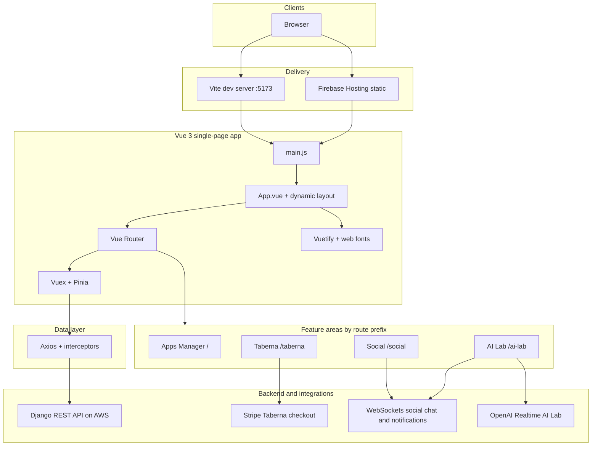

# Vue Applications Manager

A frontend application that displays a collection of projects built with Vue.js. The application provides an intuitive interface where users can browse through a list of projects, each represented as a card with an image, a short description, and buttons to either visit the live application or view more details about it.

### Live Demo on Firebase: <https://app.karnaukh-webdev.com>


## Table of Contents

- [Overview](#overview)
- [Tech Stack](#tech-stack)
- [Architecture](#architecture)
- [Sub-Applications](#sub-applications)
- [Project Structure](#project-structure)
- [Prerequisites](#prerequisites)
- [Getting Started](#getting-started)
- [Environment Variables](#environment-variables)
- [Docker Setup](#docker-setup)
- [CI/CD Pipeline](#cicd-pipeline)
- [Available Scripts](#available-scripts)
- [Backend](#backend)

## Overview

The completed test task was to create a Vue Applications Manager -- a frontend application that showcases multiple Vue.js projects in an organized and visually appealing manner. The application ensures smooth navigation, responsiveness, and ease of use.

The frontend was built using **Vue.js**, a popular JavaScript framework for building web applications. The project leverages **Vue Router** for seamless navigation between different sections. The UI components were designed using **Vuetify**, ensuring a modern, responsive, and user-friendly design.

For data fetching, the application utilizes **Axios** to retrieve project details from a **Django** backend hosted on **AWS**. The frontend itself is deployed on **Firebase Hosting**, ensuring fast and reliable access to the application. The development environment is powered by **Vite**, providing optimized build times and a smooth developer experience.

## Tech Stack

| Technology  | Purpose                          |
| ----------- | -------------------------------- |
| Vue.js 3    | Frontend framework               |
| Vue Router  | Client-side routing              |
| Vuex        | Global state management          |
| Pinia       | Store management (newer modules) |
| Vuetify 3   | Material Design UI components    |
| Axios       | HTTP client for API requests     |
| Vite        | Build tool and dev server        |
| Vuelidate   | Form validation                  |
| CryptoJS    | Client-side encryption           |
| Sass        | CSS preprocessor                 |
| Vitest      | Unit tests                       |
| @vitest/coverage-v8 | Code coverage reports    |
| Firebase    | Hosting                          |
| Docker      | Containerized development        |
| GitHub Actions | CI/CD pipeline                |

---

## Architecture



| Layer | Role |
| ----- | ---- |
| **Entry** (`main.js`) | Creates the Vue app, registers Router, Vuex, Vuetify, Pinia; sets `axios.defaults.baseURL` from `VITE_REMOTE_HOST`; loads global Axios interceptors. |
| **Shell** (`App.vue`) | Chooses the layout component from `route.meta.layout` (`mainAppsManager`, `mainTaberna`, `mainSocial`, `mainAILab`) so each sub-app keeps its own chrome. |
| **Router** (`src/shared/router/`, shim `@/router`) | Per-app `routes.js` merged in `createRouter`; `beforeEach` enforces JWT where `meta.authJWT` is true. |
| **State** (`src/store/`) | Root store for loading, alerts, and auth; namespaced modules for Taberna cart/products, Social posts/profiles/chat/notifications, and AI Lab chat. |
| **UI** (`src/shared/ui/`, `src/plugins/vuetify.js`) | Vuetify Material components; **Vuelidate** on auth and checkout forms; global toast via `AppMessage`. |
| **HTTP** (`axios`, `src/http/axiosInterceptors.js`) | JSON and multipart requests to the Django API; Taberna and Social use path prefixes such as `/taberna-store/`, `/api/social-posts/`, etc. |
| **Build** (`vite.config.mjs`) | Vue SFC compilation, `@` alias to `src/`, Vuetify auto-import plugin. |
| **CI/CD** (`.github/workflows/`) | `npm ci` + `npm run build` with secrets, then deploy the `dist/` folder to Firebase Hosting. |

**Routing at a glance**

- `/` — Apps Manager home; `/apps_manager/search` — catalog search.
- `/taberna`, `/taberna-store/...`, `/taberna/cart`, checkout and account routes — e-commerce.
- `/social/...` — social feed, profiles, chat, notifications.
- `/ai-lab/...` — AI chat, image and voice generators, realtime chat.

---

## Sub-Applications

The project contains several independent sub-applications, each with its own layout, components, and Vuex store modules:

### 1. Apps Manager (Home)

The main landing page that displays a collection of Vue.js projects as cards with images, descriptions, and action buttons.

- **Route:** `/`
- **Layout:** `MainAppsManagerLayout`
- **Features:** Project browsing, search
- **Docs:** [src/apps/apps_manager/README.md](src/apps/apps_manager/README.md)


### 2. Taberna eCommerce

A full-featured e-commerce application with product catalog, shopping cart, and Stripe checkout integration.

- **Route:** `/taberna`
- **Live Demo:** <https://app.karnaukh-webdev.com/taberna>
- **Layout:** `MainTabernaLayout`
- **Features:** Product browsing, category filtering, cart, checkout, JWT authentication, user dashboard
- **Store Modules:** `tabernaCartData`, `tabernaOrdersData`, `tabernaProductData`, `tabernaProfileData`
- **Docs:** [src/apps/taberna/README.md](src/apps/taberna/README.md)
- **Backend:** [Taberna Backend](https://karnaukh-webdev.com/category/django/taberna-drf-ecommerce/)


### 3. Social Network DRF

A social networking platform with posts, profiles, real-time chat, friend management, and notifications.

- **Route:** `/social/home`
- **Live Demo:** <https://app.karnaukh-webdev.com/social/home>
- **Layout:** `MainSocialLayout`
- **Features:** Posts feed, user profiles, friends, chat, notifications, trends, search, JWT authentication
- **Store Modules:** `socialPostData`, `socialProfileData`, `socialChatData`, `socialNotificationData`
- **Docs:** [src/apps/social/README.md](src/apps/social/README.md)
- **Backend:** [Social Network Backend](https://karnaukh-webdev.com/category/django/social-network-drf/)


### 4. AI Lab

An AI-powered laboratory with image generation, voice generation, and real-time chat capabilities.

- **Route:** `/ai-lab`
- **Live Demo:** <https://app.karnaukh-webdev.com/ai-lab>
- **Layout:** `MainAILabLayout`
- **Features:** Image generator, voice generator, real-time chat
- **Store Modules:** `aiLabChatData`
- **Backend:** [AI Lab Backend](https://karnaukh-webdev.com/category/django/ai-lab-back-end/)


## Project Structure

```
src/
├── apps/                       # Feature modules (README + screenshots at app root)
│   ├── apps_manager/           # Apps Manager (portfolio launcher)
│   ├── taberna/                # Taberna eCommerce (cart, orders, product, profiles)
│   ├── social/                 # Social network (posts, profiles, chat, notifications)
│   └── ai_lab/                 # AI Lab (chat, image, voice, realtime)
├── App.vue                     # Root component with dynamic layout switching
├── main.js                     # Application entry point
├── http/axiosInterceptors.js   # Axios JWT attach + refresh on 401
├── assets/                     # Static assets (logos, images)
├── plugins/                    # Vue plugins configuration
│   ├── vuetify.js              # Vuetify setup
│   └── webfontloader.js        # Web font loading
├── router/
│   └── index.js                # Shim → shared/router
├── shared/                     # Cross-cutting modules
│   ├── auth/                   # JWT + token auth (api, store, forms)
│   ├── router/                 # createRouter, guards, per-app route merge
│   └── ui/                     # AppMessage and other shared UI
├── store/                      # Vuex store
│   ├── index.js                # Root store; modules from src/apps/* and src/shared/*
│   └── modules/
│       └── alert.module.js
├── utils/                      # Utility functions
│   ├── cryptoUtils.js          # Encryption helpers
│   ├── domainUtils.js          # Domain-related utilities
│   └── error.js                # Error handling utilities
└── views/                      # Legacy empty dirs (views live under src/apps/)
```

## Prerequisites

- **Node.js** v22.20.0 (recommended)
- **npm** (comes with Node.js)
- **Docker** (optional, for containerized development)

## Getting Started

### 1. Clone the repository

```bash
git clone https://github.com/SerhiiKarnaukh/vue-test-manager.git
cd vue-test-manager
```

### 2. Install dependencies

```bash
npm install
```

### 3. Configure environment variables

```bash
cp .env.example .env
```

Edit the `.env` file with your configuration values (see [Environment Variables](#environment-variables)).

### 4. Start the development server

```bash
npm run dev
```

The application will be available at `http://localhost:5173`.

## Environment Variables

Create a `.env` file in the project root based on `.env.example`:

| Variable                 | Description                        | Example                      |
| ------------------------ | ---------------------------------- | ---------------------------- |
| `VITE_REMOTE_HOST`      | Backend API base URL               | `http://127.0.0.1:8000`     |
| `VITE_ENCRIPTION_KEY`   | Encryption key for CryptoJS        | `your-secret-key`           |
| `VITE_STRIPE_PUBLIC_KEY` | Stripe publishable key (Taberna)  | `pk_test_...`               |
| `VITE_STRIPE_ACTION_TYPE`| Stripe action type                | `session` or `charge`        |
| `NODE_VERSION`           | Node.js version for local setup   | `22.17.0`                    |

## Docker Setup

### Using Docker Compose

```bash
docker-compose up --build
```

This starts the development server inside a container on port **5173**.

### Using Makefile

```bash
make run        # Start dev server
make node       # Install and configure Node.js version via nvm
make update     # Clean install with dependency updates
```

## CI/CD Pipeline

The project uses **GitHub Actions** for continuous deployment to Firebase Hosting. On every push to the `main` branch, the pipeline automatically:

1. Checks out the code
2. Installs dependencies (`npm ci`)
3. Builds the production bundle (`npm run build`) with environment secrets
4. Deploys to Firebase Hosting

The workflow configuration is located at `.github/workflows/firebase-hosting-merge.yml`.

## Available Scripts

| Command          | Description                              |
| ---------------- | ---------------------------------------- |
| `npm run dev`    | Start Vite development server            |
| `npm run build`  | Build for production                     |
| `npm run serve`  | Preview the production build locally     |
| `npm run lint`   | Lint and auto-fix source files           |
| `npm run test`   | Run tests in watch mode (Vitest)         |
| `npm run test:run` | Run tests once                         |
| `npm run test:coverage` | Run tests with coverage report (CI) |

## Backend

The Django REST Framework backend is hosted on AWS and provides the API for all sub-applications.

- **Taberna Backend:** [karnaukh-webdev.com/category/django/taberna-drf-ecommerce/](https://karnaukh-webdev.com/category/django/taberna-drf-ecommerce/)
- **Social Network Backend:** [karnaukh-webdev.com/category/django/social-network-drf/](https://karnaukh-webdev.com/category/django/social-network-drf/)
- **AI Lab Backend:** [karnaukh-webdev.com/category/django/ai-lab-back-end/](https://karnaukh-webdev.com/category/django/ai-lab-back-end/)

### Customize Configuration

See [Vite Configuration Reference](https://vite.dev/config/).
